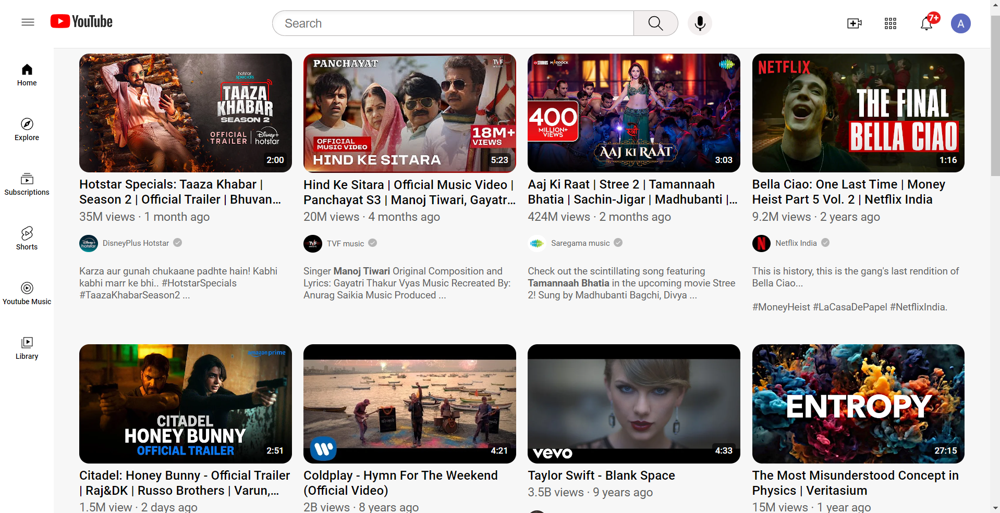

# 🎥 YouTube Front Page Clone

This project is a **front-end clone of YouTube's homepage**. It replicates the design and layout of YouTube's main page, showcasing my skills in HTML and CSS to create a modern, responsive, and visually appealing web interface.

## 🌟 Features

- **Responsive Design**: The layout adapts to different screen sizes (mobile, tablet, desktop).
- **Dynamic Content**: Populated with dynamic video thumbnails, titles, and channel details.
- **Navigation Bar**: Functional search bar, notification icon, and user profile.
- **Video Preview**: Hover effect on video thumbnails showing brief details.

## 🚀 Tech Stack

- **HTML5**: For structuring the content.
- **CSS3**: For styling the page and ensuring responsiveness.
- **Font Awesome**: For adding icons (e.g., search, notifications, user profile).
- **Google Fonts**: For custom fonts to match YouTube's style.